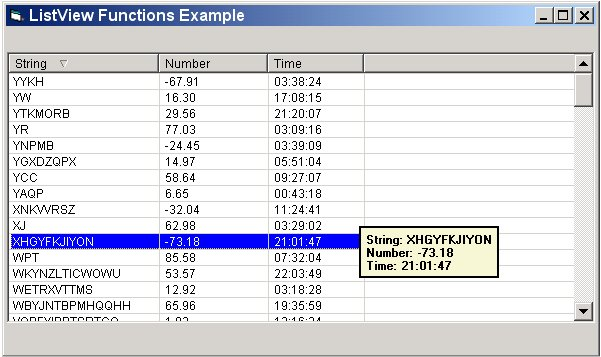



## ListView Each Row Tooltip

### Description

Hmm... I'v managed to Tooltip every row in a Listview control.

Even if its not the RIGHT way to do it, erm.. its.. WORKING.

In addition, i'v altered some of the codes on PSC in order to sort the listview control.

tell me what u guys think :)
 
### More Info
 
Listview Control

working only if "hoverselection" proprety is set to "true"

hmm.. a tooltip :)

             |
---                |---
**Submitted On**   |2003-07-10 13:51:08
**By**             |[KarahaNa](https://github.com/Planet-Source-Code/PSCIndex/blob/master/ByAuthor/karahana.md)
**Level**          |Intermediate
**User Rating**    |5.0 (10 globes from 2 users)
**Compatibility**  |VB 6\.0
**Category**       |[Windows API Call/ Explanation](https://github.com/Planet-Source-Code/PSCIndex/blob/master/ByCategory/windows-api-call-explanation__1-39.md)
**World**          |[Visual Basic](https://github.com/Planet-Source-Code/PSCIndex/blob/master/ByWorld/visual-basic.md)
**Archive File**   |[ListView\_E1615067152003\.zip](https://github.com/Planet-Source-Code/karahana-listview-each-row-tooltip__1-46801/archive/master.zip)

